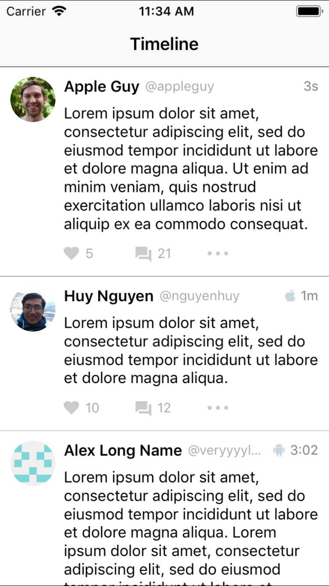
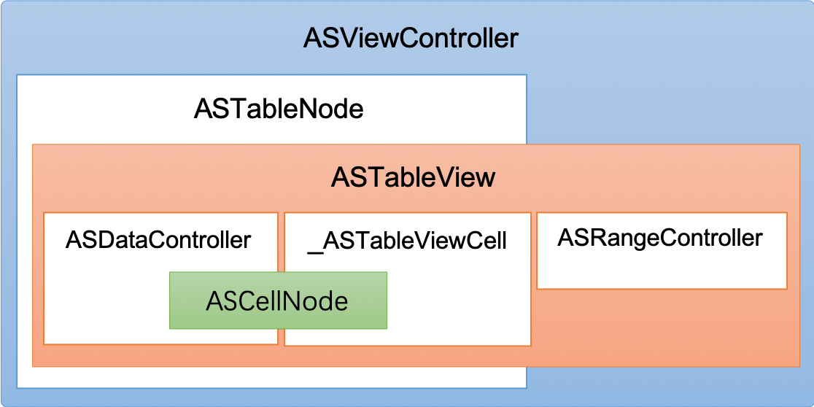
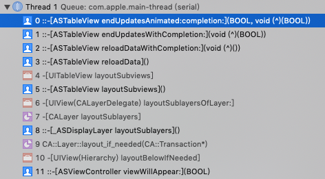
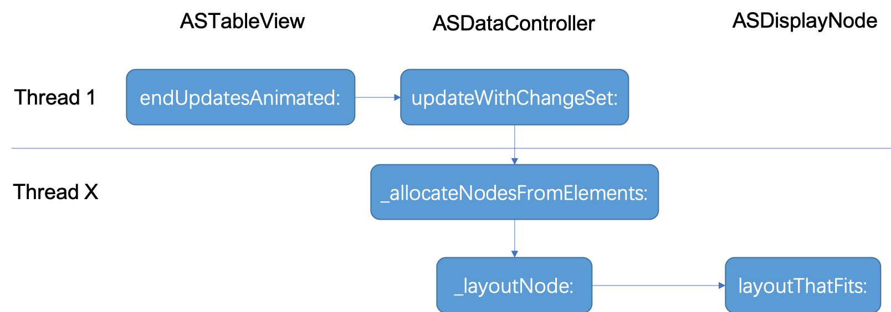
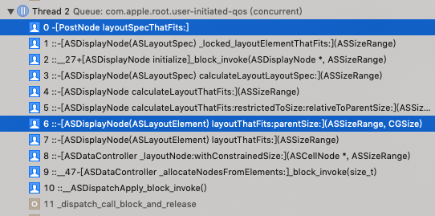
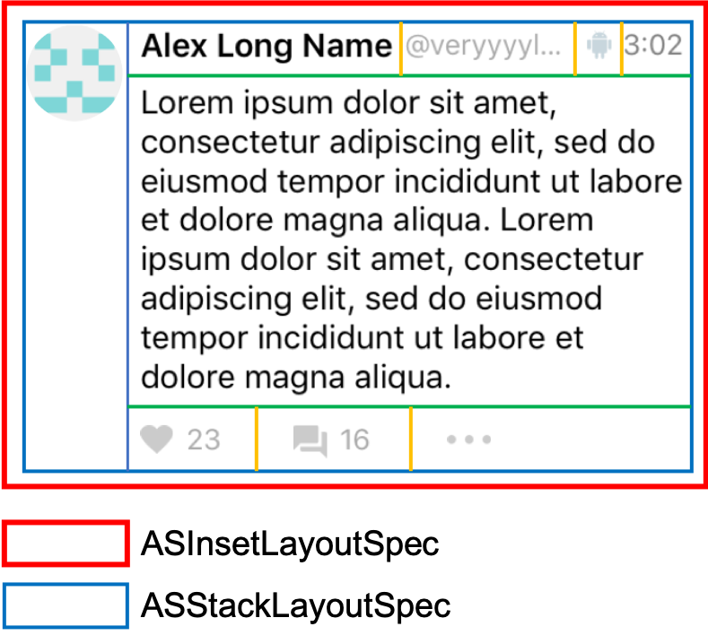
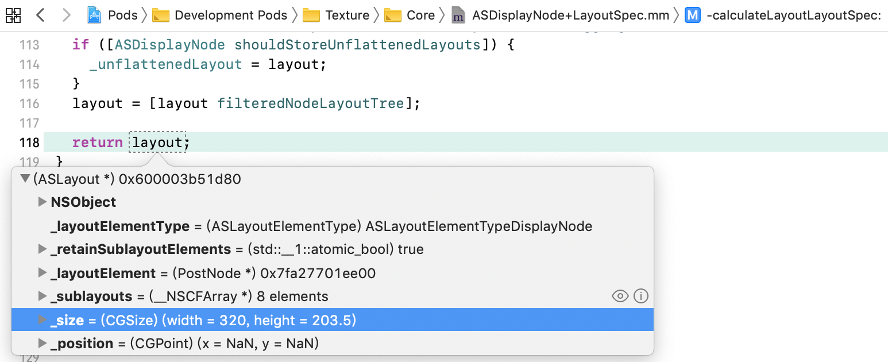
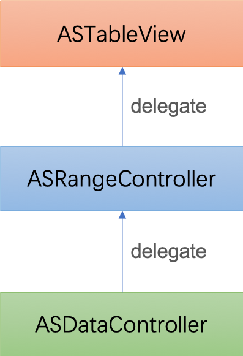
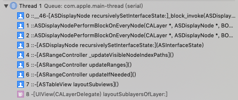

> 本文基于一个演示项目，解析了 Texture(AsyncDisplayKit) 框架中的 ASTableView 的相关类，以及它们之间的协同。从 Cell 的高度计算和展现两条线路，来探索此框架实现 TableView 异步渲染的过程。

## 前言
 [Texture](https://github.com/TextureGroup/Texture) (原为 AsyncDisplayKit ) 框架为我们提供了确保用户体验平滑和快速响应的解决方案，让 APP 可以在显示复杂内容情况下达到每秒60帧的刷新率。一直很好奇它是如何凭借异步渲染做到这一点的，于是想对其源码一探究竟。无奈源码如此浩瀚，短时间应该无法理解其精髓了😂。所以只能由浅入深，对平时用的较多的 TableView 先研究一番。
 本文围绕着 UITableView 的继承者 ASTableView 进行展开。我们基于一个案例项目，从经典的 UITableView 使用步骤："计算 Cell 高度和创建可复用的 Cell" 为切入点，来了解 UITableView 和框架的协同，为以后进一步深入打个基础。

## 案例  
 本文基于Texture框架 [2.8.1](https://github.com/TextureGroup/Texture/releases/tag/2.8.1) 版本，随着时间某些代码可能会变化。演示项目为开源库中的一个例子：[SocialAppLayout](https://github.com/TextureGroup/Texture/tree/master/examples/SocialAppLayout) 。下载后，需用 [Pods](https://cocoapods.org/) 导入依赖库(同时也会导入 Texture 框架源码)。 运行界面如下，是一个很常规的列表：

<center></center>

（本文并不介绍ASTableView的具体使用，如需要，看此演示项目也可。）

## 主要相关类  
 Texture 框架比较大，这里只列出和 ASTableView 相关的几个关键类，多了反而看花眼。它们之间大致的持有关系如下图：
<center></center>

- `ASViewController : UIViewController`。是一个 UIViewController，持有`ASDisplayNode`的，用于支持异步渲染。
- `ASTableNode : ASDisplayNode` 。用于渲染 TableView 的 Node, 它持有一个`ASTableView`对象。
- `ASTableView : UITableView` 。继承自 UITableView, 但自己实现了`cellForRowAtIndexPath:`等核心代理方法，用于与 Node 的协作。
- `ASDataController : NSObject` 。用于在后台管理和刷新布局数据的控制器。
- `_ASTableViewCell : UITableViewCell` 。配合 Node 的 UITableViewCell。
- `ASCellNode : ASDisplayNode` 。 用于 ASTableView 和 ASCollectionView 的通用 Cell Node。
- `ASRangeController : NSObject` 。与 ASDataController 配对使用，用于观察ASTableView 和 ASCollectionView 的可视范围，并驱动 Cell 进行状态变更和异步布局计算。

 实际上类之间调用非常复杂，上图只是精简出了一部分，用于大体理解。从上图看出，ASTableView 被 ASTableNode 持有的同时，也作为 ViewController 的view。多个 ASCellNode 被缓存于ASDataController 中，单个 ASCellNode 与 _ASTableViewCell 一对一绑定。

## 一个缺陷？  
 目前版本，**Cell不支持复用**。这里是指 `ASCellNode` 不被复用。如果200行数据，就会创建200个 ASCellNode 对象。当然对应的 `UITableViewCell` 依然基于 `UITableView` 而被复用。但过多的 ASCellNode 依然会引起内存问题。在上面案例中，500行数据时，整个APP内存耗用大于90MB；当5000行数据时，耗用达500MB。所以这个问题值得注意。框架开发者不支持 Cell Node 复用的理由是：可以避免大量由复用引起的Bug。所以这点算不算缺陷大家见仁见智吧。框架开发者建议大数据时，采用分批获取数据的策略，而不是一次性加载。可参考 [Batch Fetching API](http://texturegroup.org/docs/batch-fetching-api.html)。

## 计算 Cell 高度  
 对于展示动态内容的 TableView，比如朋友圈，由于内容长短不一，我们第一个遇到的问题往往是计算 Cell 的高度。ASTableView 采用的方案的是，让 Cell 在子线程中根据数据自计算布局，得到高度，然后在主线程使用。计算好的布局信息会随 ASCellNode 缓存在`ASDataController`中，以便复用。

### 触发布局计算
 要得到正确的 Cell 高度，就得先计算 Cell 布局。不论是 ASTableView 自布局，还是调用了其`reloadData`方法，都会触发布局计算。计算从`endUpdatesAnimated`方法开始，在主线程调用。调用栈：

<center></center>


 注意此时并不会触发**UI**TableView的`reloadData`方法，而是等到子线程完成计算后，再执行真正的reloadData。所以，如果子线程计算过久，界面便会出现一段时间的空白。  

 调起布局计算的过程如下图：
<center></center>

<br>

对应的精简代码如下：  
**ASTableView**  
 ASTableView 调用 ASDataController 的`updateWithChangeSet`方法更新 change set：
``` Objective-C
- (void)endUpdatesAnimated:(BOOL)animated completion:(void (^)(BOOL completed))completion
{
    //...... 代表此处省略多行代码，以便观察关键代码。下同。

    _ASHierarchyChangeSet *changeSet = _changeSet;

    //......

    [_dataController updateWithChangeSet:changeSet];
}
```

**ASDataController**  
 ASDataController会创建一个 GCD Group，在串行队列中为多个 ASCollectionElement 分配Node：
``` Objective-C
- (void)updateWithChangeSet:(_ASHierarchyChangeSet *)changeSet
{
    //......
    dispatch_group_async(_editingTransactionGroup, _editingTransactionQueue, ^{
      //......
      [self _allocateNodesFromElements:elementsToProcess];
      //......
    }
}
```
 在`_allocateNodesFromElements`方法中，会通过Block请求到一个 ASCellNode，在此例子中，即`PostNode`。 该Block是通过 ViewController 中的代理方法`nodeBlockForRowAtIndexPath`返回所得。接着对 Node 进行布局：
``` Objective-C

- (void)_allocateNodesFromElements:(NSArray<ASCollectionElement *> *)elements
{
    //......
    ASSizeRange sizeRange = element.constrainedSize;
    if (ASSizeRangeHasSignificantArea(sizeRange)) {
        [self _layoutNode:node withConstrainedSize:sizeRange];
    }
    //.....
}
```
 最终会触发 Node 自己的布局方法：
```Objective-C
- (void)_layoutNode:(ASCellNode *)node withConstrainedSize:(ASSizeRange)constrainedSize
{
  //......

  frame.size = [node layoutThatFits:constrainedSize].size;
  node.frame = frame;
}
```

**ASDisplayNode** (ASDisplayNode+Layout.mm)
 Node 自己的布局方法主要由基类`ASDisplayNode`实现。如果之前计算好的或即将显示（pending display）的布局依然可用，则直接返回。否则创建一个即将显示的布局：
```Objective-C
- (ASLayout *)layoutThatFits:(ASSizeRange)constrainedSize parentSize:(CGSize)parentSize
{
    //......
    if (_calculatedDisplayNodeLayout.isValid(constrainedSize, parentSize, version)) {
      layout = _calculatedDisplayNodeLayout.layout;
    } else if (_pendingDisplayNodeLayout.isValid(constrainedSize, parentSize, version)) {
      layout = _pendingDisplayNodeLayout.layout;
    } else {
      // Create a pending display node layout for the layout pass
      layout = [self calculateLayoutThatFits:constrainedSize
                            restrictedToSize:self.style.size
                        relativeToParentSize:parentSize];
      _pendingDisplayNodeLayout = ASDisplayNodeLayout(layout, constrainedSize, parentSize,version);
    }
    //.......
}
```

 最后`PostNode`这个开发者自定义的`ASDisplayNode`子类，会构建一个布局说明`ASLayoutSpec`，告诉父类具体的布局内容和方式。这一块也是使用此SDK的开发者的工作。调用栈：
<center></center>

 关于布局如何自定义，请参考`[PostNode layoutSpecThatFits:]`方法。它定义的 Cell 结构大体如下图：
<center></center>

 红框代表ASInsetLayoutSpec，它对它唯一的子元素实施了inset(类似padding)效果。篮框代表这个子元素，是一个水平方向的ASStackLayoutSpec，分左右两部分：左边头像，右边人名、内容等信息。右边也是一个垂直方向的ASStackLayoutSpec，而人名和点赞那两行又是水平方向的ASStackLayoutSpec。

### 布局计算
**ASDisplayNode** (ASDisplayNode+LayoutSpec.mm)  
 取得自定义的布局说明`ASLayoutSpec`后，在`ASDisplayNode (ASLayoutSpec)`分类方法`calculateLayoutLayoutSpec`中，调用`ASLayoutElement`协议规定的方法进行布局计算：
``` Objective-C
- (ASLayout *)calculateLayoutLayoutSpec:(ASSizeRange)constrainedSize
{
  //......

  // Get layout element from the node
  // 这句从PostNode处得到开发者自定义的ASLayoutSpec
  id<ASLayoutElement> layoutElement = [self _locked_layoutElementThatFits:constrainedSize];

  //......

  ASLayout *layout = ({
    AS::SumScopeTimer t(_layoutComputationTotalTime, measureLayoutComputation);
    [layoutElement layoutThatFits:constrainedSize];
  });
  
  //......
}
```

**ASInsetLayoutSpec**  
 ASLayoutSpec 中实现的 ASLayoutElement 协议方法会被调用。而 ASLayoutSpec 的子类会覆盖 ASLayoutElement 协议方法，由此实现特定行为。在此例子中，PostNode 最终返回的是`ASInsetLayoutSpec`, 因此会触发 insets 的计算：
``` Objective-C
/**
 Inset will compute a new constrained size for it's child after applying insets and re-positioning
 the child to respect the inset.
 */
- (ASLayout *)calculateLayoutThatFits:(ASSizeRange)constrainedSize
                     restrictedToSize:(ASLayoutElementSize)size
                 relativeToParentSize:(CGSize)parentSize
{

  //...... 此处省略了一堆inset计算，可打开源码查看具体
  
  //ASInsetLayoutSpec只包含一个Child, 所以直接调用该Child的布局
  ASLayout *sublayout = [self.child layoutThatFits:insetConstrainedSize parentSize:insetParentSize];

  //......
  
  return [ASLayout layoutWithLayoutElement:self size:computedSize sublayouts:@[sublayout]];
}
```

**ASStackLayoutSpec**
 由于上面A SInsetLayoutSpec 包含了一个`ASStackLayoutSpec`，所以调用 Child 布局触发了ASStackLayoutSpec 的布局计算。ASStackLayoutSpec 自己实现了协议方法`calculateLayoutThatFits:`，由该方法执行它自己的布局计算。这里比较重要的是` ASStackUnpositionedLayout::compute`方法，**CSS Flexible Box**布局的计算便由它完成。由于 CSS 计算过程比较复杂，这里不再展开，有兴趣的同学可以从以下代码追踪查看。
``` Objective-C
- (ASLayout *)calculateLayoutThatFits:(ASSizeRange)constrainedSize
{
  //......

  const auto unpositionedLayout = ASStackUnpositionedLayout::compute(stackChildren, style, constrainedSize, _concurrent);
  const auto positionedLayout = ASStackPositionedLayout::compute(unpositionedLayout, style, constrainedSize);
  
  //......

  const auto sublayouts = [NSArray<ASLayout *> arrayByTransferring:rawSublayouts count:i];
  return [ASLayout layoutWithLayoutElement:self size:positionedLayout.size sublayouts:sublayouts];
}
```
 如果 ASStackLayoutSpec 还存在多个子元素 ASLayoutElement，那么会按递归的方式计算它们的布局。最后对于一个 Cell 来说，会得到一个包含Size的布局：
<center></center>
 这个 Size 会赋值给 ASCellNode.frame, 而 ASCellNode 被 ASDataController 持有，这样便达到了缓存 Cell 高度的目的。  

 以上只出现了2种 Layout Specs，更多请参考 [Layout Specs](http://texturegroup.org/docs/layout2-layoutspec-types.html)。


### UI层获得Cell高度
 ASDataController 完成布局计算后，通过 ASRangeController 通知 ASTableView 刷新界面。它们之间的代理关系如下：
<center></center>


**ASDataController**
 完成布局计算后，在主线程，通知 ASRangeController：
``` Objective-C
- (void)updateWithChangeSet:(_ASHierarchyChangeSet *)changeSet
{
  //......

  dispatch_group_async(_editingTransactionGroup, _editingTransactionQueue, ^{
    //......

    // Step 4: Inform the delegate on main thread
    [_mainSerialQueue performBlockOnMainThread:^{
      as_activity_scope_leave(&preparationScope);
      [_delegate dataController:self updateWithChangeSet:changeSet updates:^{
        // Step 5: Deploy the new data as "completed"
        self.visibleMap = newMap;
      }];
    }];

    //......
}
```

**ASRangeController**
 通知 ASTableView：
``` Objective-C
#pragma mark - ASDataControllerDelegete

- (void)dataController:(ASDataController *)dataController updateWithChangeSet:(_ASHierarchyChangeSet *)changeSet updates:(dispatch_block_t)updates
{
  ASDisplayNodeAssertMainThread();
  if (changeSet.includesReloadData) {
    [self _setVisibleNodes:nil];
  }
  _rangeIsValid = NO;
  [_delegate rangeController:self updateWithChangeSet:changeSet updates:updates];
}
```

**ASTableView**
 得到通知，刷新界面。在以下代码中，`[super reloadData];`即调用其父类UITableView重载数据：
``` Objective-C
#pragma mark - ASRangeControllerDelegate

- (void)rangeController:(ASRangeController *)rangeController updateWithChangeSet:(_ASHierarchyChangeSet *)changeSet updates:(dispatch_block_t)updates
{
  //......

  if (changeSet.includesReloadData) {
    LOG(@"UITableView reloadData");
    ASPerformBlockWithoutAnimation(!changeSet.animated, ^{
      if (self.test_enableSuperUpdateCallLogging) {
        NSLog(@"-[super reloadData]");
      }
      updates();
      [super reloadData];
      // Flush any range changes that happened as part of submitting the reload.
      [_rangeController updateIfNeeded];
      [self _scheduleCheckForBatchFetchingForNumberOfChanges:1];
      [changeSet executeCompletionHandlerWithFinished:YES];
    });
    return;
  }

  //......
}
```


 UITableView 的代理方法被调用，从 ASDataController 中取得 Node 并返回高度：
``` Objective-C
- (CGFloat)tableView:(UITableView *)tableView heightForRowAtIndexPath:(NSIndexPath *)indexPath
{
  CGFloat height = 0.0;

  ASCollectionElement *element = [_dataController.visibleMap elementForItemAtIndexPath:indexPath];
  if (element != nil) {
    ASCellNode *node = element.node;
    
    //这里已可以取到之前计算好的或Pending Display的高度了
    height = [node layoutThatFits:element.constrainedSize].size.height;
  }

  //......
}
```
 通过以上步骤，我们大致了解了 Cell 的高度是怎么异步计算的。

## 展现 Cell  
 取得 Cell 高度后，下面便是要创建具体的 UITableViewCell 用于显示了。  
  
**ASTableView**
 ASTableView 自己实现了`cellForRowAtIndexPath:`方法。这里比较重要的是调用了ASRangeController的`configureContentView:forCellNode:`方法，它将 Node 的所带 View 作为子 View 加入到 contentView 中用于显示。代理方法代码：
``` Objective-C
- (UITableViewCell *)tableView:(UITableView *)tableView cellForRowAtIndexPath:(NSIndexPath *)indexPath
{
  _ASTableViewCell *cell = [self dequeueReusableCellWithIdentifier:kCellReuseIdentifier forIndexPath:indexPath];
  cell.delegate = self;

  ASCollectionElement *element = [_dataController.visibleMap elementForItemAtIndexPath:indexPath];
  cell.element = element;
  ASCellNode *node = element.node;
  if (node) {
    [_rangeController configureContentView:cell.contentView forCellNode:node];
  }

  return cell;
}
```

**_ASTableViewCell**
 上面`cell.element = element;`这这一句，会将 Node 带的View属性（通常我们在自定义Cell时做了这些设置）设置到 Cell，比如 Cell 背景色。代码：
``` Objective-C
- (void)setElement:(ASCollectionElement *)element
{
  _element = element;
  ASCellNode *node = element.node;
  
  if (node) {
    self.backgroundColor = node.backgroundColor;
    self.selectedBackgroundView = node.selectedBackgroundView;
    self.backgroundView = node.backgroundView;

    //.....

    // the following ensures that we clip the entire cell to it's bounds if node.clipsToBounds is set (the default)
    // This is actually a workaround for a bug we are seeing in some rare cases (selected background view
    // overlaps other cells if size of ASCellNode has changed.)
    self.clipsToBounds = node.clipsToBounds;
  }
   
  //......
}
```

**ASRangeController**
 如果当前 Node 的 View 就是 ContentView，则会跳过设置。否则当前 Node 的 View 就设置为 ContentView：
``` Objective-C
- (void)configureContentView:(UIView *)contentView forCellNode:(ASCellNode *)node
{
  //......

  if (node.view.superview == contentView) {
    // this content view is already correctly configured
    return;
  }
  
  for (UIView *view in contentView.subviews) {
    [view removeFromSuperview];
  }
  
  [contentView addSubview:node.view];
}
```

**ASDisplayNode**
 如果当前 Node 的 View 是第一次被使用，那么以上`node.view.superview`语句将触发 View 的创建过程：
``` Objective-C
- (UIView *)view
{
  //......

  if (_view != nil) {
    return _view;
  }

  //......
  
  // Loading a view needs to happen on the main thread
  ASDisplayNodeAssertMainThread();
  [self _locked_loadViewOrLayer];
  
  //......
  
  [self _locked_applyPendingStateToViewOrLayer];
  
  // The following methods should not be called with a lock
  l.unlock();

  // No need for the lock as accessing the subviews or layers are always happening on main
  [self _addSubnodeViewsAndLayers];
  
  // A subclass hook should never be called with a lock
  [self _didLoad];

  return _view;
}
```

`_locked_applyPendingStateToViewOrLayer`方法会将状态应用到 View 或者 Layer 上, 比如 frame、clipsToBounds、hidden 等很多属性：
``` Objective-C
- (void)_locked_applyPendingViewState
{
  //......

  if (_flags.layerBacked) {
    [_pendingViewState applyToLayer:_layer];
  } else {
    BOOL specialPropertiesHandling = ASDisplayNodeNeedsSpecialPropertiesHandling(checkFlag(Synchronous), _flags.layerBacked);
    [_pendingViewState applyToView:_view withSpecialPropertiesHandling:specialPropertiesHandling];
  }

  //......
}
```

**_ASPendingState**  
 _ASPendingState是尚未创建的 View 的代理。一旦 View 被创建，那么可以调用其`applyToView:`方法将状态设置到 View 。 

**ASDisplayNode+UIViewBridge**  
 那么上面的 _ASPendingState 状态从哪里来？ 一部分是在布局计算中，需要设置 View 状态时，都会设置在_ASPendingState中。在`ASDisplayNode+UIViewBridge.mm`类中有大量这样的操作，比如：
``` Objective-C
- (void)setBounds:(CGRect)newBounds
{
  _bridge_prologue_write;
  //下面这句宏调用就是将 bounds 设置到 PendingViewState 中
  _setToViewOrLayer(bounds, newBounds, bounds, newBounds);
  self.threadSafeBounds = newBounds;
}
```

**ASDisplayNode**
 对于 Sub View, `ASDisplayNode`会将上面的步骤以递归的方式创建：
``` Objective-C
- (void)_insertSubnodeSubviewOrSublayer:(ASDisplayNode *)subnode atIndex:(NSInteger)idx
{
  //......

  // If we can use view API, do. Due to an apple bug, -insertSubview:atIndex: actually wants a LAYER index,
  // which we pass in.
  if (canUseViewAPI(self, subnode)) {
    [_view insertSubview:subnode.view atIndex:idx];
  } else {
    [_layer insertSublayer:subnode.layer atIndex:(unsigned int)idx];
  }
}
```
 通过以上步骤，我们大致了解了 Cell 的 ContentView 被创建的过程。

## 预加载  
 除了异步并发渲染，预加载也是一个关键概念。这里的预加载并不是页面快滚动到某处时，创建相应 Node 准备显示。由于 ASCellNode 并不复用，所以对 ASTableView 来说，ASCellNode 已经全部创建好了。这里预加载主要是监视 Node 的界面状态（Interface State）变化，做一定的获取数据、文本光栅化、图片解码等工作。官方文档对界面状态的描述如下图：


<center></center>


在代码中，用定义了字符型枚举`ASInterfaceState`来表示状态：
``` Objective-C
typedef NS_OPTIONS(unsigned char, ASInterfaceState)
{
    /** The element is not predicted to be onscreen soon and preloading should not be performed */
    ASInterfaceStateNone          = 0,
    /** The element may be added to a view soon that could become visible.  Measure the layout, including size calculation. */
    ASInterfaceStateMeasureLayout = 1 << 0,
    /** The element is likely enough to come onscreen that disk and/or network data required for display should be fetched. */
    ASInterfaceStatePreload       = 1 << 1,
    /** The element is very likely to become visible, and concurrent rendering should be executed for any -setNeedsDisplay. */
    ASInterfaceStateDisplay       = 1 << 2,
    /** The element is physically onscreen by at least 1 pixel.
     In practice, all other bit fields should also be set when this flag is set. */
    ASInterfaceStateVisible       = 1 << 3,
    
    //......
};
```
 这里采用位或运算来记录状态变化，比如状态由 Preload 变为 Display 时，便会执行 `ASInterfaceStatePreload | ASInterfaceStateDisplay`运算，得到值为‘\x07’ (0111)。所以'\x03'代表 Preload；'\x07'代表 Display，也包含 Proload；'\x0f'代表 Visible，也包含前面所有状态。为什么要这样做？ 因为在 ASDisplayNode 类中可以根据最大状态值把前面几个小状态应做的事都做了。比如 Visible 时，如果 Preload 和 Display 对应的事没有做，那么会把它俩的事一并做了。代码：

**ASDisplayNode**
 先检测 Preload 状态，如果为旧状态未包含 Proload，则执行 Proload 相关处理。同理，Display 和 Visible 也一样。
``` Objective-C
- (void)applyPendingInterfaceState:(ASInterfaceState)newPendingState
{
  //......

  // Entered or exited data loading state.
  BOOL nowPreload = ASInterfaceStateIncludesPreload(newState);
  BOOL wasPreload = ASInterfaceStateIncludesPreload(oldState);
  
  if (nowPreload != wasPreload) {
    //......
  }
  
  // Entered or exited contents rendering state.
  BOOL nowDisplay = ASInterfaceStateIncludesDisplay(newState);
  BOOL wasDisplay = ASInterfaceStateIncludesDisplay(oldState);

  if (nowDisplay != wasDisplay) {
    //......
  }

  // Became visible or invisible.  When range-managed, this represents literal visibility - at least one pixel
  // is onscreen.  If not range-managed, we can't guarantee more than the node being present in an onscreen window.
  BOOL nowVisible = ASInterfaceStateIncludesVisible(newState);
  BOOL wasVisible = ASInterfaceStateIncludesVisible(oldState);

  if (nowVisible != wasVisible) {
    if (nowVisible) {
      [self _didEnterVisibleState];
    } else {
      [self _didExitVisibleState];
    }
  }

  //......
}
```

### 预加载的触发
 预加载由 UITableView 和 ASCollectionView 的`layoutSubviews`方法触发。页面滚动时会触发`layoutSubviews`的调用，在该方法中，会调用 ASRangeController 的`updateIfNeeded`方法，ASRangeController 便会计算哪些 Cell Node 需要更新 Interface State。调用栈：
<center></center>

**ASRangeController**
 ASRangeController 计算处于 Visible 的 Node, 并根据 Scroll Direction 计算具备新 Display 和 Preload 状态的 Node。然后更新这些 Node 的状态。主要由`_updateVisibleNodeIndexPaths`方法做这些计算，这是个很长的方法，具体请查看实际代码。
``` Objective-C
- (void)_updateVisibleNodeIndexPaths
{
  //...... 大象鼻子那么长
}
```

**ASDisplayNode**
 然后会调用 ASDisplayNode 的`recursivelySetInterfaceState:`方法，以递归的方式将新 Interface State 设置到子 Node。

``` Objective-C
- (void)recursivelySetInterfaceState:(ASInterfaceState)newInterfaceState
{
  as_activity_create_for_scope("Recursively set interface state");

  // Instead of each node in the recursion assuming it needs to schedule itself for display,
  // setInterfaceState: skips this when handling range-managed nodes (our whole subtree has this set).
  // If our range manager intends for us to be displayed right now, and didn't before, get started!
  BOOL shouldScheduleDisplay = [self supportsRangeManagedInterfaceState] && [self shouldScheduleDisplayWithNewInterfaceState:newInterfaceState];
  ASDisplayNodePerformBlockOnEveryNode(nil, self, YES, ^(ASDisplayNode *node) {
    node.interfaceState = newInterfaceState;
  });

  //......
}
```

``` Objective-C
void ASDisplayNodePerformBlockOnEveryNode(CALayer * _Nullable layer, ASDisplayNode * _Nullable node, BOOL traverseSublayers, void(^block)(ASDisplayNode *node))
{
  //......
  
  if (traverseSublayers && layer && node.rasterizesSubtree == NO) {
    /// NOTE: The docs say `sublayers` returns a copy, but it does not.
    /// See: http://stackoverflow.com/questions/14854480/collection-calayerarray-0x1ed8faa0-was-mutated-while-being-enumerated
    for (CALayer *sublayer in [[layer sublayers] copy]) {
      ASDisplayNodePerformBlockOnEveryNode(sublayer, nil, traverseSublayers, block);
    }
  } else if (node) {
    for (ASDisplayNode *subnode in [node subnodes]) {
      ASDisplayNodePerformBlockOnEveryNode(nil, subnode, traverseSublayers, block);
    }
  }
}
```
 最终，ASCellNode 包含的 ASImageNode、ASTextNode 等会根据状态执行自己的操作。


## 小结  
 通过以上代码追踪，我们了解了围绕着 ASTableView 的相关类，以及它们之间如何协同来做到异步渲染。从 Cell 高度计算而触发的布局计算，到展现 Cell 时在主线程创建 Cell Content View，并将异步计算的布局结果等信息设置到 View 中。最后，还看了下预加载的相关机制。但这一遍走下来，离 Texture 框架的核心部分还是比较远，只能算是理了一波代码线索。希望后面有时间再继续深入。

> 转载请保留出处: https://blog.happyyun.com/ 非常感谢！