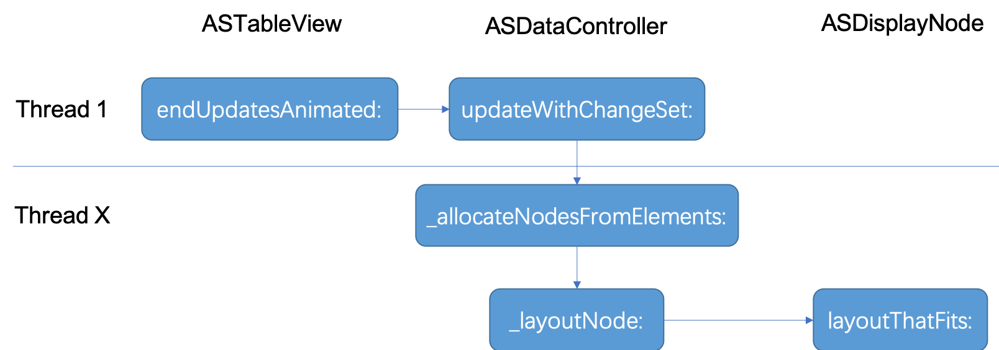

> 本文根据案例解析了Texture(AsyncDisplayKit)框架中的ASTableView。

## 前言
 [Texture](https://github.com/TextureGroup/Texture)(原为AsyncDisplayKit)框架为我们提供了确保用户体验平滑和快速响应的解决方案，让我们的APP可以在显示复杂内容情况下达到每秒60帧的刷新率。一直很好奇它是如何凭借异步渲染做到这一点的，于是想对其源码一探究竟。无奈源码如此浩瀚，短时间应该无法理解其精髓了😂。所以只能由浅入深，对平时用的较多的TableView先研究一番。
 本文围绕着UITableView的继承者ASTableView进行展开。ASTableView通过大量骚操作(约2000行代码)，和神队友(相关类)一起，实现了UITableView与Texture框架异步渲染机制的集成，达到了德芙般的丝滑。我们基于一个案例项目，从经典的UITableView使用步骤："计算Cell高度和创建可复用的Cell" 为切入点，来了解UITableView和框架的协同，为以后进一步深入打个基础。

## 案例
 本文基于Texture框架[2.8.1](https://github.com/TextureGroup/Texture/releases/tag/2.8.1)版本，随着时间某些代码可能会变化。演示项目为开源库中的一个例子：[SocialAppLayout](https://github.com/TextureGroup/Texture/tree/master/examples/SocialAppLayout) 。下载后，需用[Pods](https://cocoapods.org/)导入依赖库(同时也会导入Texture框架源码)。 运行界面如下，是一个很常规的列表：

<center></center>

（本文并不介绍ASTableView的具体使用，如需要，看此演示项目也可了解。）

## 主要相关类  
Texture框架比较大，这里只列出和ASTableView相关的几个关键类，多了反而看花眼。它们之间大致的持有关系如下图：
<center></center>

- `ASViewController : UIViewController`。持有`ASDisplayNode`的UIViewController，用于支持异步渲染。
- `ASTableNode : ASDisplayNode` 。用于渲染TableView的Node, 它持有一个`ASTableView`对象。
- `ASTableView : UITableView` 。继承自UITableView, 但自己实现了`cellForRowAtIndexPath:`等核心代理方法，用于与Node协作。
- `ASDataController : NSObject` 。用于在后台管理和刷新布局数据的控制器。
- `_ASTableViewCell : UITableViewCell` 。配合Node的UITableViewCell。
- `ASCellNode : ASDisplayNode` 。 用于ASTableView和ASCollectionView的通用Cell Node。
- `ASRangeController : NSObject` 。与ASDataController配对使用，用于观察ASTableView 和 ASCollectionView 的可视范围，并做相应的渲染和驱动Cell进行异步布局计算。

实际上类之间调用非常复杂，上图只是精简出了一部分，用于大体理解。从上图看出，ASTableView被ASTableNode持有的同时，也作为ViewController的view。多个ASCellNode被缓存于ASDataController中，单个ASCellNode与_ASTableViewCell一对一绑定。

## 计算Cell高度  
 对于展示动态内容的TableView，比如朋友圈，由于内容长短不一，我们第一个遇到的问题往往是计算Cell的高度。ASTableView采用的方案的是，让Cell在子线程中根据数据自计算布局，得到高度，然后在主线程使用。计算好的布局信息会随ASCellNode缓存在`ASDataController`，以便复用。

### 触发布局计算
 要得到正确的Cell高度，就得先计算Cell布局。不论是ASTableView自布局，还是调用了其`reloadData`方法，都会触发布局计算。计算从`endUpdatesAnimated`方法开始，在主线程调用。调用栈：


注意此时并不会触发**UI**TableView的`reloadData`方法，而是等到子线程完成计算后，再执行真正的reloadData。所以，如果子线程计算过久，界面便会出现一段时间的空白。  

调起布局计算的过程如下图：
<center></center>

<br>

对应的精简代码如下：  
**ASTableView**  
ASTableView调用ASDataController的`updateWithChangeSet`方法更新change set：
``` Objective-C
- (void)endUpdatesAnimated:(BOOL)animated completion:(void (^)(BOOL completed))completion
{
    //...... 代表此处省略多行代码，以便观察关键代码。下同。

    _ASHierarchyChangeSet *changeSet = _changeSet;

    //......

    [_dataController updateWithChangeSet:changeSet];
}
```

**ASDataController**  
ASDataController会创建一个GCD Group，在串行队列中为多个ASCollectionElement分配Node：
``` Objective-C
- (void)updateWithChangeSet:(_ASHierarchyChangeSet *)changeSet
{
    //......
    dispatch_group_async(_editingTransactionGroup, _editingTransactionQueue, ^{
      //......
      [self _allocateNodesFromElements:elementsToProcess];
      //......
    }
}
```
在_allocateNodesFromElements方法中，会通过Block请求到一个ASCellNode，在此例子中，即`PostNode`。 该Block即ViewController中的代理方法`nodeBlockForRowAtIndexPath`返回所得。接着对Node进行布局：
``` Objective-C

- (void)_allocateNodesFromElements:(NSArray<ASCollectionElement *> *)elements
{
    //......
    ASSizeRange sizeRange = element.constrainedSize;
    if (ASSizeRangeHasSignificantArea(sizeRange)) {
        [self _layoutNode:node withConstrainedSize:sizeRange];
    }
    //.....
}
```
最终会触发Node自己的布局方法：
```Objective-C
- (void)_layoutNode:(ASCellNode *)node withConstrainedSize:(ASSizeRange)constrainedSize
{
  //......

  frame.size = [node layoutThatFits:constrainedSize].size;
  node.frame = frame;
}
```

**ASDisplayNode** (ASDisplayNode+Layout.mm)
Node自己的布局方法主要由基类`ASDisplayNode`实现。如果之前计算好的或即将显示（pending display）的布局依然可用，则直接返回。否则创建一个即将显示的布局：
```Objective-C
- (ASLayout *)layoutThatFits:(ASSizeRange)constrainedSize parentSize:(CGSize)parentSize
{
    //......
    if (_calculatedDisplayNodeLayout.isValid(constrainedSize, parentSize, version)) {
      layout = _calculatedDisplayNodeLayout.layout;
    } else if (_pendingDisplayNodeLayout.isValid(constrainedSize, parentSize, version)) {
      layout = _pendingDisplayNodeLayout.layout;
    } else {
      // Create a pending display node layout for the layout pass
      layout = [self calculateLayoutThatFits:constrainedSize
                            restrictedToSize:self.style.size
                        relativeToParentSize:parentSize];
      _pendingDisplayNodeLayout = ASDisplayNodeLayout(layout, constrainedSize, parentSize,version);
    }
    //.......
}
```

最后`PostNode`这个开发者自定义的`ASDisplayNode`子类，会构建一个布局说明`ASLayoutSpec`，告诉父类具体的布局内容和方式。这一块也是使用此SDK开发者的工作。调用栈：


关于布局如何自定义，请参考`[PostNode layoutSpecThatFits:]`方法。它的结构大体如下图：
<center></center>

红框代表ASInsetLayoutSpec，它对它唯一的子元素实施了inset(类似padding)效果。篮框代表这个子元素，是一个水平方向的ASStackLayoutSpec，分左右两部分：左边头像，右边人名、内容等信息。右边也是一个垂直方向的ASStackLayoutSpec，而人名和点赞那两行又是水平方向的ASStackLayoutSpec。

### 布局计算
**ASDisplayNode** (ASDisplayNode+LayoutSpec.mm)  
取得自定义的布局说明`ASLayoutSpec`后，在`ASDisplayNode (ASLayoutSpec)`分类方法`calculateLayoutLayoutSpec`中，调用`ASLayoutElement`协议规定的方法进行布局计算：
``` Objective-C
- (ASLayout *)calculateLayoutLayoutSpec:(ASSizeRange)constrainedSize
{
  //......

  // Get layout element from the node
  // 这句从PostNode处得到开发者自定义的ASLayoutSpec
  id<ASLayoutElement> layoutElement = [self _locked_layoutElementThatFits:constrainedSize];

  //......

  ASLayout *layout = ({
    AS::SumScopeTimer t(_layoutComputationTotalTime, measureLayoutComputation);
    [layoutElement layoutThatFits:constrainedSize];
  });
  
  //......
}
```

**ASInsetLayoutSpec**  
ASLayoutSpec中实现的ASLayoutElement协议方法会被调用。而ASLayoutSpec的子类会覆盖ASLayoutElement协议方法，由此实现特定行为。在此例子中，PostNode最终返回的是`ASInsetLayoutSpec`, 因此会触发insets的计算：
``` Objective-C
/**
 Inset will compute a new constrained size for it's child after applying insets and re-positioning
 the child to respect the inset.
 */
- (ASLayout *)calculateLayoutThatFits:(ASSizeRange)constrainedSize
                     restrictedToSize:(ASLayoutElementSize)size
                 relativeToParentSize:(CGSize)parentSize
{

  //...... 此处省略了一堆inset计算，可打开源码查看具体
  
  //ASInsetLayoutSpec只包含一个Child, 所以直接调用该Child的布局
  ASLayout *sublayout = [self.child layoutThatFits:insetConstrainedSize parentSize:insetParentSize];

  //......
  
  return [ASLayout layoutWithLayoutElement:self size:computedSize sublayouts:@[sublayout]];
}
```

**ASStackLayoutSpec**
由于上面ASInsetLayoutSpec包含了一个`ASStackLayoutSpec`，所以调用Child布局触发了ASStackLayoutSpec的布局计算。ASStackLayoutSpec自己实现了协议方法`calculateLayoutThatFits:`，由该方法执行它自己的布局计算。这里比较重要的是` ASStackUnpositionedLayout::compute`方法，**CSS Flexible Box**布局的计算便由它完成。由于CSS计算过程比较复杂，这里不再展开，有兴趣的同学可以从以下代码追踪查看。
``` Objective-C
- (ASLayout *)calculateLayoutThatFits:(ASSizeRange)constrainedSize
{
  //......

  const auto unpositionedLayout = ASStackUnpositionedLayout::compute(stackChildren, style, constrainedSize, _concurrent);
  const auto positionedLayout = ASStackPositionedLayout::compute(unpositionedLayout, style, constrainedSize);
  
  //......

  const auto sublayouts = [NSArray<ASLayout *> arrayByTransferring:rawSublayouts count:i];
  return [ASLayout layoutWithLayoutElement:self size:positionedLayout.size sublayouts:sublayouts];
}
```
如果ASStackLayoutSpec还存在多个子元素ASLayoutElement，那么会按递归的方式计算它们的布局。最后对于一个Cell来说，会得到一个包含Size的布局：
<center></center>
这个Size会被赋予ASCellNode.frame, 而node被ASDataController持有，便达到了缓存Cell高度的目的。  

以上只出现了2种Layout Specs，更多参考[Layout Specs](http://texturegroup.org/docs/layout2-layoutspec-types.html)。


### UI层获得Cell高度
ASDataController完成布局计算后，通过ASRangeController通知ASTableView刷新界面。它们之间的代理关系如下：
<center></center>


**ASDataController**
完成布局计算后，在主线程，通知ASRangeController：
``` Objective-C
- (void)updateWithChangeSet:(_ASHierarchyChangeSet *)changeSet
{
  //......

  dispatch_group_async(_editingTransactionGroup, _editingTransactionQueue, ^{
    //......

    // Step 4: Inform the delegate on main thread
    [_mainSerialQueue performBlockOnMainThread:^{
      as_activity_scope_leave(&preparationScope);
      [_delegate dataController:self updateWithChangeSet:changeSet updates:^{
        // Step 5: Deploy the new data as "completed"
        self.visibleMap = newMap;
      }];
    }];

    //......
}
```

**ASRangeController**
通知ASTableView：
``` Objective-C
#pragma mark - ASDataControllerDelegete

- (void)dataController:(ASDataController *)dataController updateWithChangeSet:(_ASHierarchyChangeSet *)changeSet updates:(dispatch_block_t)updates
{
  ASDisplayNodeAssertMainThread();
  if (changeSet.includesReloadData) {
    [self _setVisibleNodes:nil];
  }
  _rangeIsValid = NO;
  [_delegate rangeController:self updateWithChangeSet:changeSet updates:updates];
}
```

**ASTableView**
得到通知，刷新界面。在以下代码中，`[super reloadData];`即调用其父类UITableView重载数据：
``` Objective-C
#pragma mark - ASRangeControllerDelegate

- (void)rangeController:(ASRangeController *)rangeController updateWithChangeSet:(_ASHierarchyChangeSet *)changeSet updates:(dispatch_block_t)updates
{
  //......

  if (changeSet.includesReloadData) {
    LOG(@"UITableView reloadData");
    ASPerformBlockWithoutAnimation(!changeSet.animated, ^{
      if (self.test_enableSuperUpdateCallLogging) {
        NSLog(@"-[super reloadData]");
      }
      updates();
      [super reloadData];
      // Flush any range changes that happened as part of submitting the reload.
      [_rangeController updateIfNeeded];
      [self _scheduleCheckForBatchFetchingForNumberOfChanges:1];
      [changeSet executeCompletionHandlerWithFinished:YES];
    });
    return;
  }

  //......
}
```


UITableView的代理方法被调用，从ASDataController中取得Node并返回高度：
``` Objective-C
- (CGFloat)tableView:(UITableView *)tableView heightForRowAtIndexPath:(NSIndexPath *)indexPath
{
  CGFloat height = 0.0;

  ASCollectionElement *element = [_dataController.visibleMap elementForItemAtIndexPath:indexPath];
  if (element != nil) {
    ASCellNode *node = element.node;
    
    //这里已可以取到之前计算好的或Pending Display的高度了
    height = [node layoutThatFits:element.constrainedSize].size.height;
  }

  //......
}
```
通过以上步骤，我们大致了解了Cell的高度是怎么被异步计算的。

## 展现Cell  
 取得 Cell 高度后，下面便是要创建具体的 Cell 用于显示了。  
  
**ASTableView**
ASTableView自己实现了`cellForRowAtIndexPath:`方法。这里比较重要的是调用了ASRangeController的`configureContentView:forCellNode:`方法，它将Node的所带View作为子View加入到contentView中用于显示。代理方法代码：
``` Objective-C
- (UITableViewCell *)tableView:(UITableView *)tableView cellForRowAtIndexPath:(NSIndexPath *)indexPath
{
  _ASTableViewCell *cell = [self dequeueReusableCellWithIdentifier:kCellReuseIdentifier forIndexPath:indexPath];
  cell.delegate = self;

  ASCollectionElement *element = [_dataController.visibleMap elementForItemAtIndexPath:indexPath];
  cell.element = element;
  ASCellNode *node = element.node;
  if (node) {
    [_rangeController configureContentView:cell.contentView forCellNode:node];
  }

  return cell;
}
```

**_ASTableViewCell**
上面`cell.element = element;`这这一句，会将 Node 带的View属性（通常我们在自定义Cell时做了这些设置）设置到 Cell，比如 Cell 背景色。代码：
``` Objective-C
- (void)setElement:(ASCollectionElement *)element
{
  _element = element;
  ASCellNode *node = element.node;
  
  if (node) {
    self.backgroundColor = node.backgroundColor;
    self.selectedBackgroundView = node.selectedBackgroundView;
    self.backgroundView = node.backgroundView;

    //.....

    // the following ensures that we clip the entire cell to it's bounds if node.clipsToBounds is set (the default)
    // This is actually a workaround for a bug we are seeing in some rare cases (selected background view
    // overlaps other cells if size of ASCellNode has changed.)
    self.clipsToBounds = node.clipsToBounds;
  }
   
  //......
}
```

**ASRangeController**
如果当前 Node 的 View 就是 ContentView，则会跳过设置。否则当前 Node 的 View 就设置为 ContentView：
``` Objective-C
- (void)configureContentView:(UIView *)contentView forCellNode:(ASCellNode *)node
{
  //......

  if (node.view.superview == contentView) {
    // this content view is already correctly configured
    return;
  }
  
  for (UIView *view in contentView.subviews) {
    [view removeFromSuperview];
  }
  
  [contentView addSubview:node.view];
}
```

**ASDisplayNode**
如果当前 Node 的 View 是第一次被使用，那么以上`node.view.superview`语句将触发 View 的创建过程：
``` Objective-C
- (UIView *)view
{
  //......

  if (_view != nil) {
    return _view;
  }

  //......
  
  // Loading a view needs to happen on the main thread
  ASDisplayNodeAssertMainThread();
  [self _locked_loadViewOrLayer];
  
  //......
  
  [self _locked_applyPendingStateToViewOrLayer];
  
  // The following methods should not be called with a lock
  l.unlock();

  // No need for the lock as accessing the subviews or layers are always happening on main
  [self _addSubnodeViewsAndLayers];
  
  // A subclass hook should never be called with a lock
  [self _didLoad];

  return _view;
}
```

`_locked_applyPendingStateToViewOrLayer`方法会将状态应用到View或者Layer上, 比如 frame、clipsToBounds、hidden 等巨多属性：
``` Objective-C
- (void)_locked_applyPendingViewState
{
  //......

  if (_flags.layerBacked) {
    [_pendingViewState applyToLayer:_layer];
  } else {
    BOOL specialPropertiesHandling = ASDisplayNodeNeedsSpecialPropertiesHandling(checkFlag(Synchronous), _flags.layerBacked);
    [_pendingViewState applyToView:_view withSpecialPropertiesHandling:specialPropertiesHandling];
  }

  //......
}
```

**_ASPendingState**  
_ASPendingState是尚未创建的 View 的代理。一旦 View 被创建，那么可以调用其`applyToView:`方法将状态设置到 View 。 

**ASDisplayNode+UIViewBridge**  
那么上面的 _ASPendingState 状态从哪里来？ 一部分是在布局计算中，需要设置View状态时，都会设置在_ASPendingState中。在`ASDisplayNode+UIViewBridge.mm`类中有大量这样的操作，比如：
``` Objective-C
- (void)setBounds:(CGRect)newBounds
{
  _bridge_prologue_write;
  //下面这句宏调用就是将 bounds 设置到 PendingViewState 中
  _setToViewOrLayer(bounds, newBounds, bounds, newBounds);
  self.threadSafeBounds = newBounds;
}
```

**ASDisplayNode**
对于 Sub View, `ASDisplayNode`会将上面的步骤以递归的方式创建：
``` Objective-C
- (void)_insertSubnodeSubviewOrSublayer:(ASDisplayNode *)subnode atIndex:(NSInteger)idx
{
  //......

  // If we can use view API, do. Due to an apple bug, -insertSubview:atIndex: actually wants a LAYER index,
  // which we pass in.
  if (canUseViewAPI(self, subnode)) {
    [_view insertSubview:subnode.view atIndex:idx];
  } else {
    [_layer insertSublayer:subnode.layer atIndex:(unsigned int)idx];
  }
}
```
通过以上步骤，我们大致了解Cell的ContentView被创建的过程。

## 预加载  

<center></center>


**ASRangeController**
``` Objective-C
- (void)_updateVisibleNodeIndexPaths
{
}
```

**ASDisplayNode**


``` Objective-C
- (void)_didEnterPreloadState
{
  ASDisplayNodeAssertMainThread();
  DISABLED_ASAssertUnlocked(__instanceLock__);
  [self didEnterPreloadState];
  
  // If this node has ASM enabled and is not yet visible, force a layout pass to apply its applicable pending layout, if any,
  // so that its subnodes are inserted/deleted and start preloading right away.
  //
  // - If it has an up-to-date layout (and subnodes), calling -layoutIfNeeded will be fast.
  //
  // - If it doesn't have a calculated or pending layout that fits its current bounds, a measurement pass will occur
  // (see -__layout and -_u_measureNodeWithBoundsIfNecessary:). This scenario is uncommon,
  // and running a measurement pass here is a fine trade-off because preloading any time after this point would be late.
  
  if (self.automaticallyManagesSubnodes && !ASActivateExperimentalFeature(ASExperimentalDidEnterPreloadSkipASMLayout)) {
    [self layoutIfNeeded];
  }
  [self enumerateInterfaceStateDelegates:^(id<ASInterfaceStateDelegate> del) {
    [del didEnterPreloadState];
  }];
}
```

## 小结  
