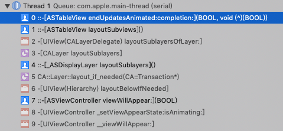

##ASTableView
参考案例：SocialAppLayout， https://github.com/TextureGroup/Texture/tree/master/examples/SocialAppLayout

关键类：ASTableNode:ASDisplayNode
ASTableView:UITableView
ASTableNode 持有 ASTableView

不论是ASTableView自布局，还是调用了`reloadData`方法，都会触发布局计算。这里布局计算的入口方法为`endUpdatesAnimated`。如图：



ASTableView:
``` Objective-C
- (void)endUpdatesAnimated:(BOOL)animated completion:(void (^)(BOOL completed))completion
{
    //......
    _ASHierarchyChangeSet *changeSet = _changeSet;
    //......
    [_dataController updateWithChangeSet:changeSet];
}
```

ASDataController:

``` Objective-C
- (void)updateWithChangeSet:(_ASHierarchyChangeSet *)changeSet
{
    dispatch_group_async(_editingTransactionGroup, _editingTransactionQueue, ^{

//......

[self _allocateNodesFromElements:elementsToProcess];
//......
    }
}
```

``` Objective-C

- (void)_allocateNodesFromElements:(NSArray<ASCollectionElement *> *)elements
{
    //......
    ASSizeRange sizeRange = element.constrainedSize;
    if (ASSizeRangeHasSignificantArea(sizeRange)) {
        [self _layoutNode:node withConstrainedSize:sizeRange];
    }
    //.....
}
```

```Objective-C
- (void)_layoutNode:(ASCellNode *)node withConstrainedSize:(ASSizeRange)constrainedSize
{
//......

  frame.size = [node layoutThatFits:constrainedSize].size;
//......

}
```

ASDisplayNode (ASDisplayNode+Layout.mm):
```Objective-C
- (ASLayout *)layoutThatFits:(ASSizeRange)constrainedSize parentSize:(CGSize)parentSize
{
    //......

    // Create a pending display node layout for the layout pass
    layout = [self calculateLayoutThatFits:constrainedSize
                          restrictedToSize:self.style.size
                      relativeToParentSize:parentSize];

//......
    _pendingDisplayNodeLayout = ASDisplayNodeLayout(layout, constrainedSize, parentSize,version);


  //.......
}
```

ASTableView:
``` Objective-C
- (CGFloat)tableView:(UITableView *)tableView heightForRowAtIndexPath:(NSIndexPath *)indexPath
{
  CGFloat height = 0.0;

  ASCollectionElement *element = [_dataController.visibleMap elementForItemAtIndexPath:indexPath];
  if (element != nil) {
    ASCellNode *node = element.node;
    ASDisplayNodeAssertNotNil(node, @"Node must not be nil!");
    height = [node layoutThatFits:element.constrainedSize].size.height;
  }

  //......
}
```