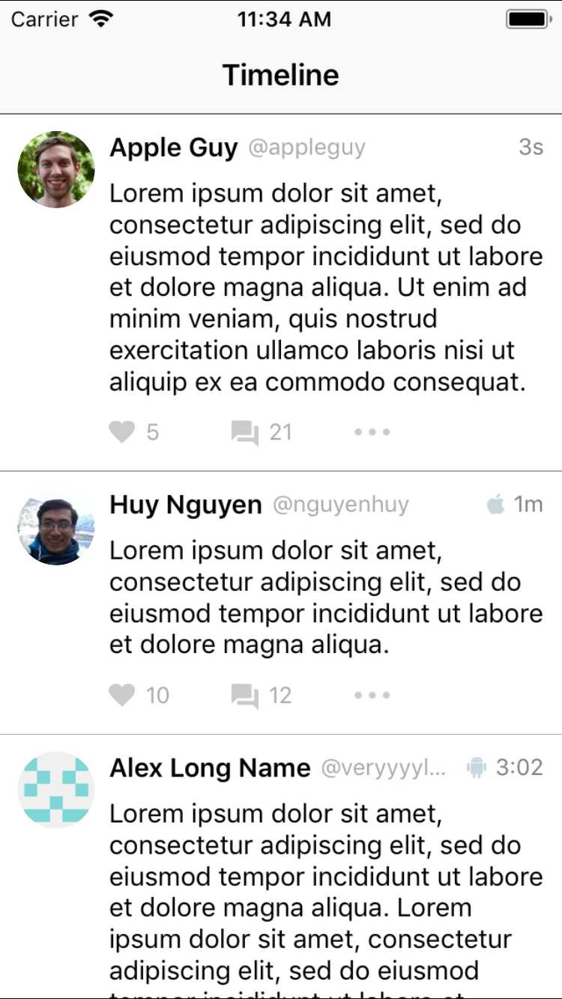
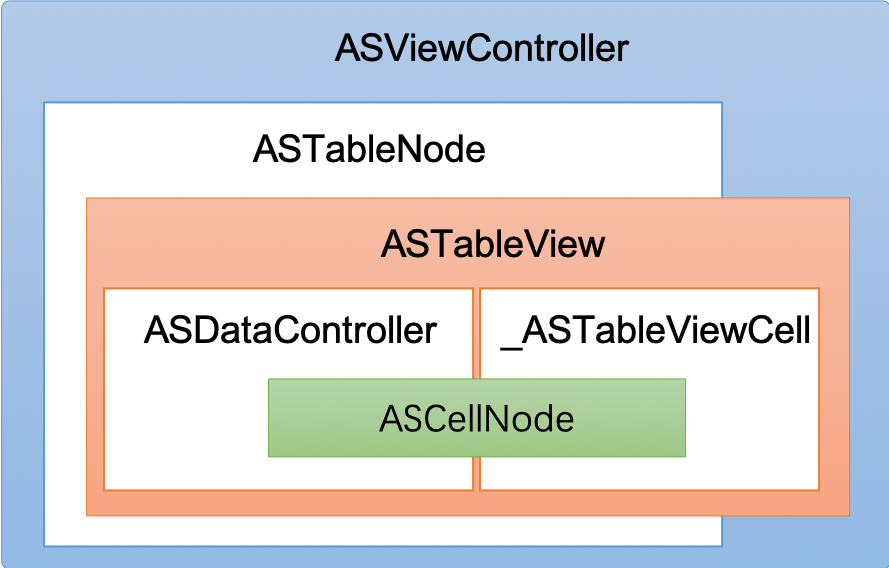
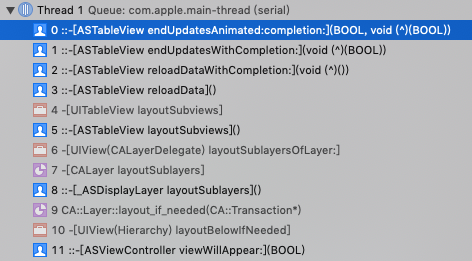
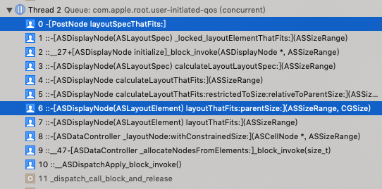

> 本文根据案例解析了Texture(AsyncDisplayKit)框架中的ASTableView。

## 前言
 [Texture](https://github.com/TextureGroup/Texture)(原为AsyncDisplayKit)框架的强大已不必说。对于AsyncDisplayKit的源码分析，下面这篇文章总结了很多关键点，非常值得参考：[《AsyncDisplayKit源码分析》](https://github.com/LeoMobileDeveloper/Blogs/blob/master/iOS/Anaylize%20AsyncDisplayKit.md)。如果刚接触这个框架，建议先看上面一文。 本文主要针对ASTableView进行展开，TableView平时用的非常多，也较容易发生卡顿。通过对ASTableView源码的学习，可以了解大神如何将异步渲染机制和UITableView机制相结合，做到复杂列表界面的流畅。万一项目中要造类似的轮子，相关的思路就可以借鉴了。

## 案例
 本文基于Texture框架[2.8.1](https://github.com/TextureGroup/Texture/releases/tag/2.8.1)版本，随着时间某些代码可能会变化。演示项目为开源库中的一个例子：[SocialAppLayout](https://github.com/TextureGroup/Texture/tree/master/examples/SocialAppLayout) 。下载后，需用[Pods](https://cocoapods.org/)导入依赖库(同时也会导入Texture框架源码)。 运行界面如下：

<center></center>

（本文并不介绍ASTableView的具体使用，如需要，看此演示项目也可了解。）

## 关键类  
Texture框架比较大，这里只列出和ASTableView相关的几个关键类，多了反而看花眼。它们之间大致的持有关系如下图：
<center></center>

- `ASViewController : UIViewController`。持有`ASDisplayNode`的UIViewController，用于支持异步渲染。
- `ASTableNode : ASDisplayNode` 。用于渲染TableView的Node, 它持有一个`ASTableView`对象。
- `ASTableView : UITableView` 。继承自UITableView, 但自己实现了`cellForRowAtIndexPath:`等核心代理方法，用于与Node协作。
- `ASDataController : NSObject` 。用于在后台管理和刷新布局数据的控制器。
- `_ASTableViewCell : UITableViewCell` 。配合Node的UITableViewCell。
- `ASCellNode : ASDisplayNode` 。 用于ASTableView和ASCollectionView的通用Cell Node。

实际上类之间调用非常复杂，上图只是精简出了一部分，用于大体理解。从上图看出，ASTableView被ASTableNode持有的同时，也作为ViewController的view。多个ASCellNode被缓存于ASDataController中，单个ASCellNode与_ASTableViewCell一对一绑定。

### 计算Cell高度  
 对于展示动态内容的TableView，比如朋友圈，由于内容长短不定，我们第一个遇到的问题往往是计算Cell的高度。ASTableView采用的方案的是，让Cell在子线程中根据数据自计算布局，得到高度，然后在主线程使用。计算好的布局信息会随ASCellNode缓存在`ASDataController`，以便复用。  
 不论是ASTableView自布局，还是调用了`reloadData`方法，都会触发布局计算。这里布局计算的入口方法为`endUpdatesAnimated`。如图：




ASTableView:
``` Objective-C
- (void)endUpdatesAnimated:(BOOL)animated completion:(void (^)(BOOL completed))completion
{
    //......
    _ASHierarchyChangeSet *changeSet = _changeSet;
    //......
    [_dataController updateWithChangeSet:changeSet];
}
```

ASDataController:

``` Objective-C
- (void)updateWithChangeSet:(_ASHierarchyChangeSet *)changeSet
{
    //......
    dispatch_group_async(_editingTransactionGroup, _editingTransactionQueue, ^{
      //......
      [self _allocateNodesFromElements:elementsToProcess];
      //......
    }
}
```

``` Objective-C

- (void)_allocateNodesFromElements:(NSArray<ASCollectionElement *> *)elements
{
    //......
    ASSizeRange sizeRange = element.constrainedSize;
    if (ASSizeRangeHasSignificantArea(sizeRange)) {
        [self _layoutNode:node withConstrainedSize:sizeRange];
    }
    //.....
}
```

```Objective-C
- (void)_layoutNode:(ASCellNode *)node withConstrainedSize:(ASSizeRange)constrainedSize
{
  //......
  frame.size = [node layoutThatFits:constrainedSize].size;
  //......
}
```

ASDisplayNode (ASDisplayNode+Layout.mm):
```Objective-C
- (ASLayout *)layoutThatFits:(ASSizeRange)constrainedSize parentSize:(CGSize)parentSize
{
    //......
    if (_calculatedDisplayNodeLayout.isValid(constrainedSize, parentSize, version)) {
      layout = _calculatedDisplayNodeLayout.layout;
    } else if (_pendingDisplayNodeLayout.isValid(constrainedSize, parentSize, version)) {
      layout = _pendingDisplayNodeLayout.layout;
    } else {
      // Create a pending display node layout for the layout pass
      layout = [self calculateLayoutThatFits:constrainedSize
                            restrictedToSize:self.style.size
                        relativeToParentSize:parentSize];
      _pendingDisplayNodeLayout = ASDisplayNodeLayout(layout, constrainedSize, parentSize,version);
    }
    //.......
}
```

最后`PostNode`这个自定义的`ASCellNode`得到机会，根据Model内容计算布局。调用栈：



ASTableView:
``` Objective-C
- (CGFloat)tableView:(UITableView *)tableView heightForRowAtIndexPath:(NSIndexPath *)indexPath
{
  CGFloat height = 0.0;

  ASCollectionElement *element = [_dataController.visibleMap elementForItemAtIndexPath:indexPath];
  if (element != nil) {
    ASCellNode *node = element.node;
    ASDisplayNodeAssertNotNil(node, @"Node must not be nil!");
    height = [node layoutThatFits:element.constrainedSize].size.height;
  }

  //......
}
```