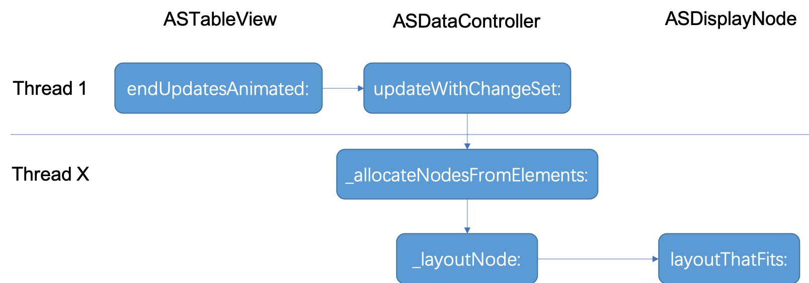
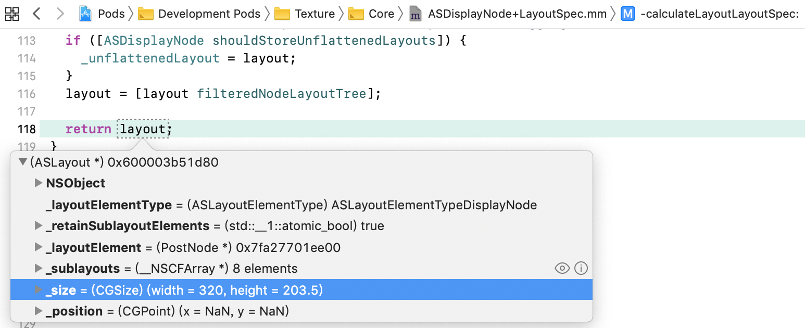

> 本文根据案例解析了Texture(AsyncDisplayKit)框架中的ASTableView。

## 前言
 [Texture](https://github.com/TextureGroup/Texture)(原为AsyncDisplayKit)框架的强大已不必说。对于AsyncDisplayKit的源码分析，下面这篇文章总结了很多关键点，非常值得参考：[《AsyncDisplayKit源码分析》](https://github.com/LeoMobileDeveloper/Blogs/blob/master/iOS/Anaylize%20AsyncDisplayKit.md)。如果刚接触这个框架，建议先看上面一文。 本文主要针对ASTableView进行展开，TableView平时用的非常多，也较容易发生卡顿。通过对ASTableView源码的学习，可以了解大神如何将异步渲染机制和UITableView机制相结合，做到复杂列表界面的流畅。万一项目中要造类似的轮子，相关的思路就可以借鉴了。

## 案例
 本文基于Texture框架[2.8.1](https://github.com/TextureGroup/Texture/releases/tag/2.8.1)版本，随着时间某些代码可能会变化。演示项目为开源库中的一个例子：[SocialAppLayout](https://github.com/TextureGroup/Texture/tree/master/examples/SocialAppLayout) 。下载后，需用[Pods](https://cocoapods.org/)导入依赖库(同时也会导入Texture框架源码)。 运行界面如下：

<center></center>

（本文并不介绍ASTableView的具体使用，如需要，看此演示项目也可了解。）

## 关键类  
Texture框架比较大，这里只列出和ASTableView相关的几个关键类，多了反而看花眼。它们之间大致的持有关系如下图：
<center></center>

- `ASViewController : UIViewController`。持有`ASDisplayNode`的UIViewController，用于支持异步渲染。
- `ASTableNode : ASDisplayNode` 。用于渲染TableView的Node, 它持有一个`ASTableView`对象。
- `ASTableView : UITableView` 。继承自UITableView, 但自己实现了`cellForRowAtIndexPath:`等核心代理方法，用于与Node协作。
- `ASDataController : NSObject` 。用于在后台管理和刷新布局数据的控制器。
- `_ASTableViewCell : UITableViewCell` 。配合Node的UITableViewCell。
- `ASCellNode : ASDisplayNode` 。 用于ASTableView和ASCollectionView的通用Cell Node。

实际上类之间调用非常复杂，上图只是精简出了一部分，用于大体理解。从上图看出，ASTableView被ASTableNode持有的同时，也作为ViewController的view。多个ASCellNode被缓存于ASDataController中，单个ASCellNode与_ASTableViewCell一对一绑定。

## 计算Cell高度  
 对于展示动态内容的TableView，比如朋友圈，由于内容长短不定，我们第一个遇到的问题往往是计算Cell的高度。ASTableView采用的方案的是，让Cell在子线程中根据数据自计算布局，得到高度，然后在主线程使用。计算好的布局信息会随ASCellNode缓存在`ASDataController`，以便复用。

### 触发布局计算
 不论是ASTableView自布局，还是调用了`reloadData`方法，都会触发布局计算。计算从方法`endUpdatesAnimated`开始，在主线程调用。如图：


注意此时并不会触发UITableView的`reloadData`方法，而是等到子线程完成计算后，再执行真正的reloadData。所以，如果子线程计算过久，界面便会出现一段时间的空白。  

调起布局计算的过程如下图：
<center></center>

<br>

对应的精简代码如下：  
**ASTableView**  
ASTableView调用ASDataController的`updateWithChangeSet`方法更新change set：
``` Objective-C
- (void)endUpdatesAnimated:(BOOL)animated completion:(void (^)(BOOL completed))completion
{
    //...... 代表此处省略多行代码，下同
    _ASHierarchyChangeSet *changeSet = _changeSet;
    //......
    [_dataController updateWithChangeSet:changeSet];
}
```

**ASDataController**  
ASDataController创建一个GCD的Group，在串行队列中为多个ASCollectionElement分配Node：
``` Objective-C
- (void)updateWithChangeSet:(_ASHierarchyChangeSet *)changeSet
{
    //......
    dispatch_group_async(_editingTransactionGroup, _editingTransactionQueue, ^{
      //......
      [self _allocateNodesFromElements:elementsToProcess];
      //......
    }
}
```
在_allocateNodesFromElements方法中，会通过Block请求到一个ASCellNode，在此例子中，即`PostNode`。 该Block即ViewController中的代理方法`nodeBlockForRowAtIndexPath`返回所得。接着对Node进行布局：
``` Objective-C

- (void)_allocateNodesFromElements:(NSArray<ASCollectionElement *> *)elements
{
    //......
    ASSizeRange sizeRange = element.constrainedSize;
    if (ASSizeRangeHasSignificantArea(sizeRange)) {
        [self _layoutNode:node withConstrainedSize:sizeRange];
    }
    //.....
}
```
最终会触发Node自己的布局方法：
```Objective-C
- (void)_layoutNode:(ASCellNode *)node withConstrainedSize:(ASSizeRange)constrainedSize
{
  //......
  frame.size = [node layoutThatFits:constrainedSize].size;
  //......
}
```

**ASDisplayNode** (ASDisplayNode+Layout.mm)
如果之前计算好的或即将显示的布局依然可用，则直接返回。否则创建一个即将显示的布局：
```Objective-C
- (ASLayout *)layoutThatFits:(ASSizeRange)constrainedSize parentSize:(CGSize)parentSize
{
    //......
    if (_calculatedDisplayNodeLayout.isValid(constrainedSize, parentSize, version)) {
      layout = _calculatedDisplayNodeLayout.layout;
    } else if (_pendingDisplayNodeLayout.isValid(constrainedSize, parentSize, version)) {
      layout = _pendingDisplayNodeLayout.layout;
    } else {
      // Create a pending display node layout for the layout pass
      layout = [self calculateLayoutThatFits:constrainedSize
                            restrictedToSize:self.style.size
                        relativeToParentSize:parentSize];
      _pendingDisplayNodeLayout = ASDisplayNodeLayout(layout, constrainedSize, parentSize,version);
    }
    //.......
}
```

最后`PostNode`这个自定义的`ASDisplayNode`子类，会构建一个布局说明`ASLayoutSpec`，告诉父类具体的布局内容和方式。这一块也是使用此SDK开发者的工作。调用栈：


### 布局计算
**ASDisplayNode** (ASDisplayNode+LayoutSpec.mm)  
取得自定义的布局说明`ASLayoutSpec`后，在`ASDisplayNode (ASLayoutSpec)`分类方法`calculateLayoutLayoutSpec`中，调用`ASLayoutElement`协议规定的方法进行布局计算：
``` Objective-C
- (ASLayout *)calculateLayoutLayoutSpec:(ASSizeRange)constrainedSize
{
  //......

  // Get layout element from the node
  // 这句从PostNode出得到开发者自定义的ASLayoutSpec
  id<ASLayoutElement> layoutElement = [self _locked_layoutElementThatFits:constrainedSize];

  //......

  ASLayout *layout = ({
    AS::SumScopeTimer t(_layoutComputationTotalTime, measureLayoutComputation);
    [layoutElement layoutThatFits:constrainedSize];
  });
  
  //......
}
```

**ASInsetLayoutSpec**  
ASLayoutSpec中实现的ASLayoutElement协议方法会被调用。而ASLayoutSpec的子类会覆盖ASLayoutElement协议方法，由此实现特定行为。在此例子中，PostNode最终返回的是`ASInsetLayoutSpec`, 因此会触发insets的计算：
``` Objective-C
/**
 Inset will compute a new constrained size for it's child after applying insets and re-positioning
 the child to respect the inset.
 */
- (ASLayout *)calculateLayoutThatFits:(ASSizeRange)constrainedSize
                     restrictedToSize:(ASLayoutElementSize)size
                 relativeToParentSize:(CGSize)parentSize
{

  //...... 此处省略了一堆inset计算，可打开源码查看具体
  
  //ASInsetLayoutSpec只包含一个Child, 所以直接调用该Child的布局
  ASLayout *sublayout = [self.child layoutThatFits:insetConstrainedSize parentSize:insetParentSize];

  //......
  
  return [ASLayout layoutWithLayoutElement:self size:computedSize sublayouts:@[sublayout]];
}
```

**ASStackLayoutSpec**
由于上面ASInsetLayoutSpec包含了一个`ASStackLayoutSpec`，所以调用Child布局触发了ASStackLayoutSpec的布局计算。ASStackLayoutSpec自己实现了协议方法`calculateLayoutThatFits:`，由该方法执行它自己的布局计算。这里比较重要的是` ASStackUnpositionedLayout::compute`方法，CSS Flexible Box布局的计算便由它完成。由于CSS计算比较复杂，这里不再展开，有兴趣的同学可以从以下代码追踪查看。
``` Objective-C
- (ASLayout *)calculateLayoutThatFits:(ASSizeRange)constrainedSize
{
  //......

  const auto unpositionedLayout = ASStackUnpositionedLayout::compute(stackChildren, style, constrainedSize, _concurrent);
  const auto positionedLayout = ASStackPositionedLayout::compute(unpositionedLayout, style, constrainedSize);
  
  //......

  const auto sublayouts = [NSArray<ASLayout *> arrayByTransferring:rawSublayouts count:i];
  return [ASLayout layoutWithLayoutElement:self size:positionedLayout.size sublayouts:sublayouts];
}
```
如果ASStackLayoutSpec还存在多个子元素ASLayoutElement，那么会按递归的方式计算它们的布局。最后对于一个Cell来说，会得到一个包含Size的布局：
<center></center>
这个Size会被赋予ASCellNode.frame, 而node被ASDataController持有，便达到了缓存Cell高度的目的。  

以上只出现了2种Layout Specs，更多参考[Layout Specs](http://texturegroup.org/docs/layout2-layoutspec-types.html)。


### UI展现

**ASDataController**


**ASTableView**
回到主线程，在UITableView的代理方法中，从ASDataController中取得Node并返回高度：
``` Objective-C
- (CGFloat)tableView:(UITableView *)tableView heightForRowAtIndexPath:(NSIndexPath *)indexPath
{
  CGFloat height = 0.0;

  ASCollectionElement *element = [_dataController.visibleMap elementForItemAtIndexPath:indexPath];
  if (element != nil) {
    ASCellNode *node = element.node;
    ASDisplayNodeAssertNotNil(node, @"Node must not be nil!");
    height = [node layoutThatFits:element.constrainedSize].size.height;
  }

  //......
}
```